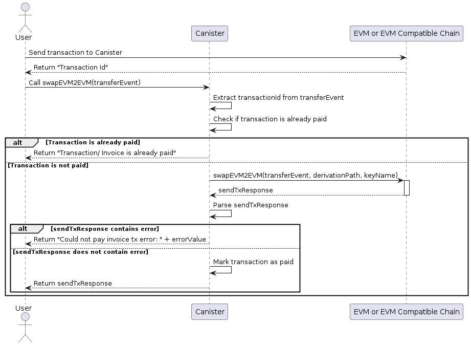
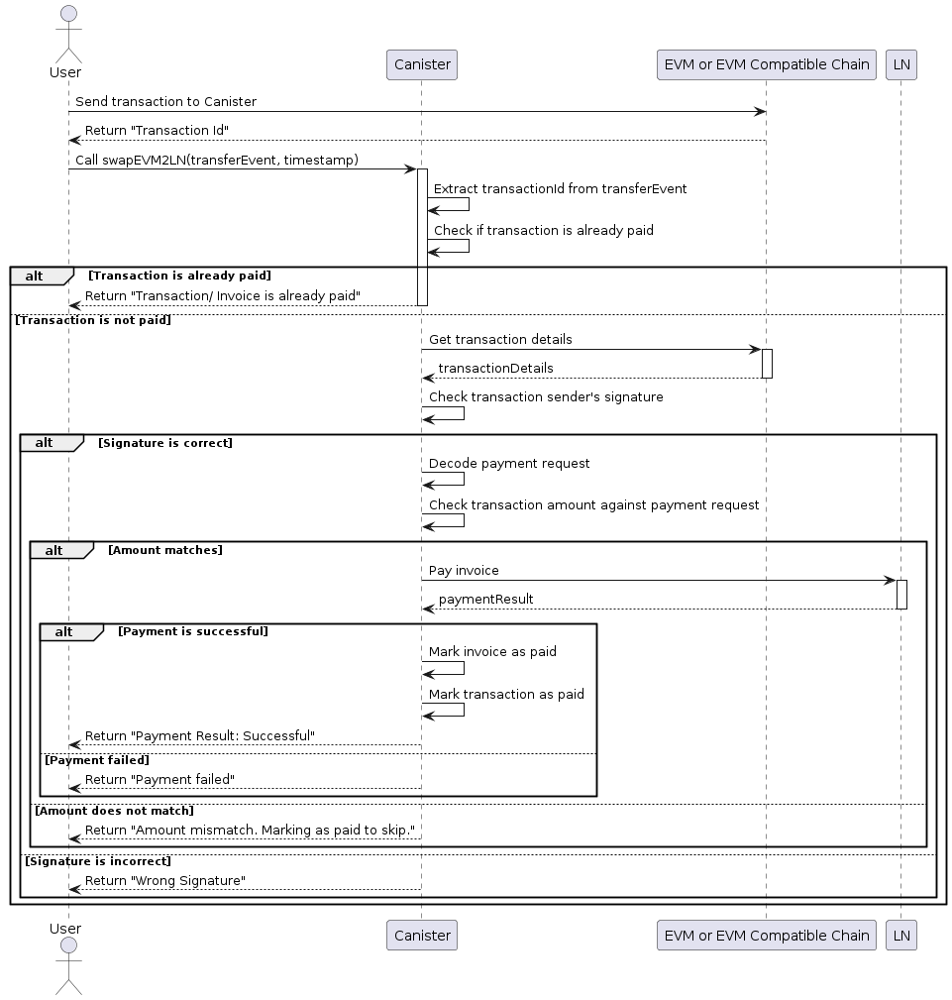
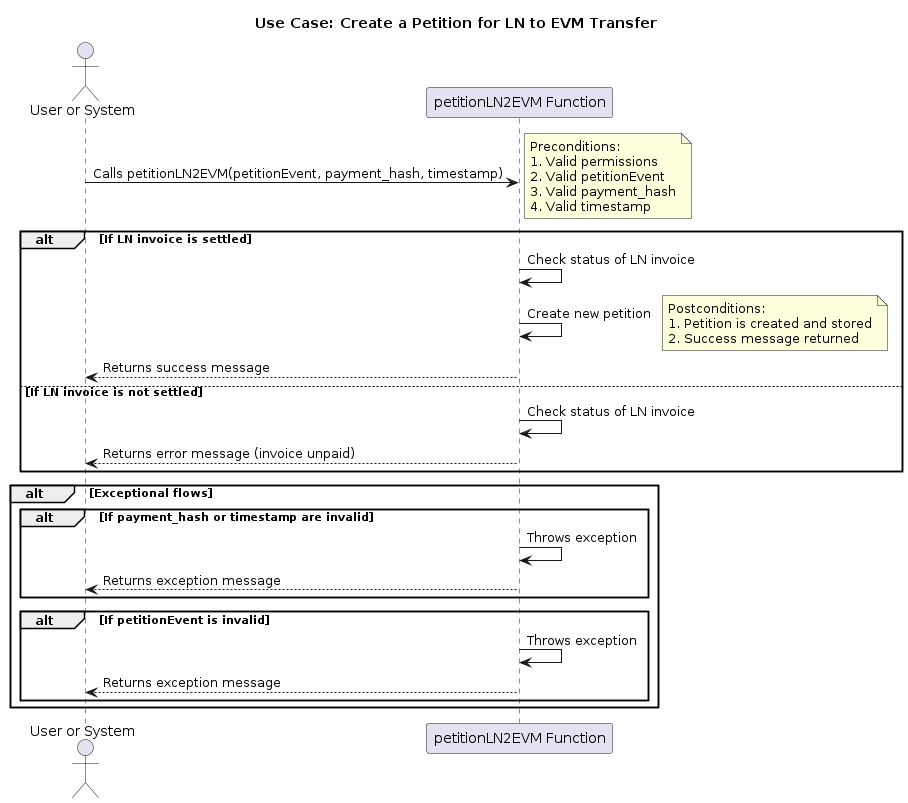
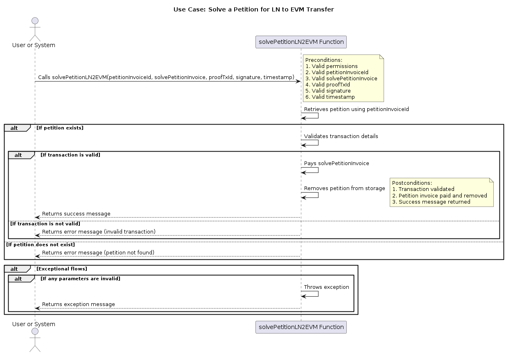

# ICPMake

## Introduction

**ICPMake** is a groundbreaking project designed to bridge the gap between Ethereum Virtual Machine (EVM) compatible chains and the Bitcoin Lightning Network using the Internet Computer Protocol (ICP) stack. By leveraging Chain Fusion Technology, ICPMake facilitates seamless swaps of satoshis between the Lightning Network and EVM-compatible chains, offering a secure and efficient transactional framework.

ICPMake operates using the ECDSA API, ensuring high-security transactions across different blockchain networks. It supports two primary methods for executing swaps: a peer-to-peer marketplace system and swaps executed directly by the canister. This flexibility allows users to choose the method that best suits their needs.

## Key Features

- **ECDSA API Integration:** Ensures high security for transactions across different chains.
- **EVM Chain Compatibility:** Enables smooth and efficient transactions between EVM chains.
- **Lightning Network Support:** Explores integration possibilities with Bitcoin's Lightning Network.

## Technologies Used

- **ICP:** For handling HTTP requests and smart contract interactions.
- **ICP Canister:** Interacts with EVM chains and Lightning networks.
- **Express.js API:** Manages requests from the canister.
- **Motoko, Webln, Ethers.js:** Core technologies for functionality.

## Getting Started

1. **Installation:**
   - Clone the repository: `git clone [repository URL]`.
   - Install DFX, the development and deployment tool for the Internet Computer.
   - Navigate to the project directory and initialize the project using `dfx init`.
   - Install necessary dependencies using `npm install` or `yarn install`.

2. **Configuration:**
   - Configure `dfx.json` for your local and network settings.
   - Set up environment variables for interacting with ICP and other services (e.g., API keys, network addresses).
   - For EVM chains interaction, configure connection settings and smart contract addresses.
   - Deploy a local version using `dfx deploy` to test the configuration.

## Use Cases and UML Diagrams

### Use Case: Swap EVM to EVM

**Actor:** User

**Preconditions:**
- Valid TransferEvent with necessary details (e.g., chains, addresses, proofTxId).

**Flow of Events:**
1. User sends a transaction to the canister.
2. Call `swapEVM2EVM` with the TransferEvent.
3. Check transaction payment status.
4. Perform the swap if payment is confirmed.
5. Notify user of success or failure.

**Postconditions:**
- User is notified of transaction status (paid, successful, or failed).

### Use Case: Swap EVM to Lightning Network

**Actor:** User

**Preconditions:**
- Valid TransferEvent, timestamp, derivation path, and key name.

**Flow of Events:**
1. User sends a transaction to the canister.
2. Call `swapEVM2LN` with TransferEvent and timestamp.
3. Verify transaction payment status and signature.
4. Decode payment request and attempt payment via Lightning Network.
5. Notify user of success or failure.

**Postconditions:**
- User is notified based on payment success or failure.

### Use Case: Create a Petition for LN to EVM Transfer

**Actor:** User

**Preconditions:**
- Valid PetitionEvent, payment hash, and timestamp.

**Flow of Events:**
1. Call `petitionLN2EVM` with necessary parameters.
2. Check LN invoice status.
3. Create a petition if invoice is settled.
4. Return success message or error if applicable.

**Postconditions:**
- Petition is created and stored if successful.

### Use Case: Solve a Petition for LN to EVM Transfer

**Actor:** User

**Preconditions:**
- Valid petition invoice ID, solve petition invoice, proofTxId, signature, and timestamp.

**Flow of Events:**
1. Call `solvePetitionLN2EVM` with required parameters.
2. Validate transaction and payment.
3. Remove petition and return result.

**Postconditions:**
- Petition is solved, or error is returned if transaction fails.

## Business Proposal

### Objective
The proposal outlines strategies for capitalizing on liquidity through ICPMake, enhancing the bridge's utility, and fostering a robust economic environment for EVM and LN balances.

### Current Liquidity Captivation Strategy

#### Exclusive Investment in Swaps
We will act as the sole liquidity provider for initial swaps through ICPMake, earning fees as determined by market conditions.

#### Petition-Based Swap Architecture
The petition-based architecture enhances liquidity through a reward-driven process, encouraging active participation. Rewards for solving petitions include transaction fees or asset shares, fostering a sustainable liquidity cycle.

## How to Use
- Detailed user guides are available in the repository for managing cross-chain transactions.
